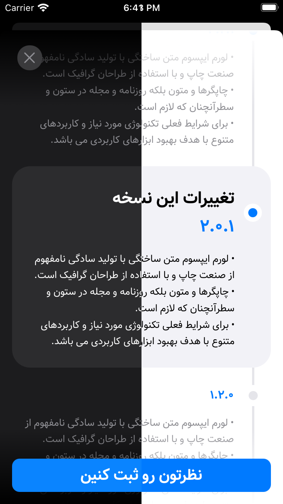

<div dir='rtl'>

# نسخه‌کیت

## ویژگی‌ها
### 📱 پشتیبانی از آیفون و آی‌پد.
### 😋 خوشگله
### 🥳 ایز آو یوز.

<br>

## پیش‌نمایش!

<div style='text-align: center;'>
  
</div>

<br>

## این چیکار می‌کنه؟!
با استفاده از این نیمچه کتابخونه، می‌تونین تغییرات هر نسخه رو بصورت یه لیست نشون بدین. همینطور می‌تونین تغییرات آتی رو هم پیشاپیش به کاربراتون معرفی کنین! 😎


## چجوری ازش استفاده کنیم؟

### قدم اول. نصب
عبارت زیر رو به فایل `Podfile` پروژه اضافه کنین:

<pre dir='ltr'>
pod 'NoskheKit'
</pre>

و بعد از `pod install`، هرجایی که خواستین ازش استفاده کنین، `import NoskheKit` کنین.

<br>

### قدم دوم. نمایش تغییرات
متد اصلی که کنترلر تغییرات  رو نشون میده، دارای امضای زیر هست:

<div dir='ltr'>

```swift
NoskheKit.presentChangesController(
  from               sourceController : UIViewController,
  withData           versionsData     : NKVersionsData,
  andUIConfiguration uiConfiguration  : NKUIConfiguration
)
```

</div>

پارامترهایی که این متد می‌گیره بصورت زیر هست:
- پارامتر `sourceController`: از نوع `UIViewController` هست و در واقع ویوکنترلر مبدا هست.
- پارامتر `versionsData`: از نوع `NKVersionsData` هست. این مدل اطلاعات اصلی لیست تغییرات رو در اختیار کتابخونه می‌ذاره.
- پارامتر `uiConfiguration`: از نوع `NKUIConfiguration` هست. این مدل، تنظیمات مربوط به رابط کاربری رو آماده می‌کنه. با استفاده از این مدل، می‌تونین رابط کاربری رو شخصی‌سازی کنین.

<br><hr><br>

## مدل‌ها

### مدل `NKVersionsData`
این مدل، داده‌های مورد نیاز برای نمایش لیست تغییرات رو فراهم می‌کنه. برای ساخت  این مدل، چند روش آماده شده:

<br>

#### 1️⃣ سازنده `init?(plistFileConfiguration: PlistFileConfiguration)`
داده‌ها رو با استفاده از المانی از نوع `PlistFileConfiguration` آماده می‌کنه. در واقع این سازنده، پارامتری رو دریافت می‌کنه که با استفاده از اون، گزینه‌های مربوط به فایل Plist دارای لیست تغییرات، تعریف شده. 

- چون بنا به دلایلی ممکنه فایل موجود نباشه، یا بدرستی تنظیم نشده باشه، این سازنده بصورت <code dir='ltr'>init?</code> تعریف شده.
- در صورت بروز خطا و همچنین شرایط خاص، پیام متناسب توی `Console` چاپ میشه.
- ساختار مورد استفاده برای فایل Plist  معتبر بصورت زیر هست. در صورت نیاز، می‌تونین فایل `Versions-EN.plist` توی پروژه Example رو ببینین.

<pre dir='ltr'>
Root: Array
- Item 0  : Dictionary
  - number  : String
  - changes : Array
    - Item 0  : String
    - Item 1  : String
    - ...
- ...
</pre>

<br>

#### 2️⃣ سازنده `init(from decoder: Decoder)`
مدل `NKVersionsData` پروتکل `Decodable` رو پیاده‌سازی کرده. در نتیجه می‌تونیم لیست تغییرات رو از API خودمون بگیریم و داده دریافتی رو به این مدل دیکد کنیم.

- ساختار معتبر JSON برای استفاده از این سازنده بصورت زیرهست:

<div dir='ltr'>

```
{
  items: [
    {
      number: 'string',
      changes: [
        'string',
        'string',
        ...
      ]
    },
    ...
  ]
}
```

</div>

<br>

### مدل `PlistFileConfiguration`
این مدل برای در نظر گرفتن فایل Plist برای آماده‌سازی داده‌ها برای نمایش لیست تغییرات مورد استفاده قرار می‌گیره.

- سازنده این مدل بصورت `init(bundle: Bundle, fileName: String)` هست که پارامتر اول باندل، و پارامتر دوم اسم فایل Plist رو مشخص می‌کنه.
- یه گزینه `default` برای این نوع در نظر گرفته شده، که فایلی با نام `Versions` رو از باندل `main` مورد استفاده قرار میده.

<br>

### مدل `NKUIConfiguration`
این مدل، تنظیمات مربوط به رابط کاربری رو آماده می‌کنه. مشخصه‌های این مدل بصورت زیر هست:

<div dir='ltr'>

```swift
class NKUIConfiguration {
  var isRightToLeft: Bool = false
  var submitReviewButtonStatus: SubmitReviewButtonStatus = .notExist
  var versionsDisplayConfiguration: VersionsDisplayConfiguration = .init()
}
```

</div>

- مشخصه `isRightToLeft`: مشخص‌کننده این هست که ویوها برای زبان‌های راست‌چین پیکربندی بشن یا نه.
- مشخصه `submitReviewButtonStatus`: تنظیمات مربوط به دکمه «ثبت نظر» رو آماده میشه.
- مشخصه `versionsDisplayConfiguration`: این مشخصه، تنظیمات مربوط به نمایش نسخه‌ها رو مشخص می‌کنه.

<br>

### مدل `SubmitReviewButtonStatus`
این مدل، در واقع یه `enum` هست، که دارای `case`های زیر هست.
- گزینه `notExist`: دکمه «ثبت نظر» نمایش داده نمیشه.
- گزینه `exist(configuration: Configuration)`: دکمه «ثبت نظر» نمایش داده میشه و تنظیمات نمایش هم با استفاده از `configuration` آماده میشه.

<br>

### مدل `SubmitReviewButtonStatus.Configuration`
این مدل بصورت زیر هست:

<div dir='ltr'>

```swift
class Configuration {
  let title           : String
  var font            : UIFont
  var backgroundColor : UIColor
  var textColor       : UIColor
}
```

</div>

- بجز `title`، بقیه مشخصه‌ها دارای مقدار پیش‌فرض هستن.

<br>

### مدل `CurrentVersionDisplayConfiguration` و `OtherVersionDisplayConfiguration`
این دو مدل، برای تنظیمات نمایش نسخه‌ها مورد استفاده قرار می‌گیرن. اولی برای نمایش تغییرات نسخه فعلی، و دومی برای نمایش تغییرات بقیه نسخه‌ها.

هر دو شبیه هم هستن، فقط با یه تفاوت: اولی، یه مشخصه هم برای نمایش What'sNew داره.

ساختار کلی‌شون بصورت زیر هست:

<div dir='ltr'>

```swift
class ... {
  var whatsNew     : WhatsNewUIConfiguration? //ONLY in CurrentVersionDisplayConfiguration

  var titleColor   : UIColor
  var titleFont    : UIFont
  var changesColor : UIColor
  var changesFont  : UIFont
}
```

</div>

- همه مشخصه‌ها دارای مقدار پیش‌فرض هستن.

<br>

### مدل `WhatsNewUIConfiguration` 
تنظیمات نمایش What'sNew  رو آماده می‌کنه. دوتا مشخصه بیشتر نداره:

<div dir='ltr'>

```swift
struct WhatsNewUIConfiguration {
  var text      : String
  var textColor : UIColor
}
```

</div>

## دِ اِند. 😎

</div>